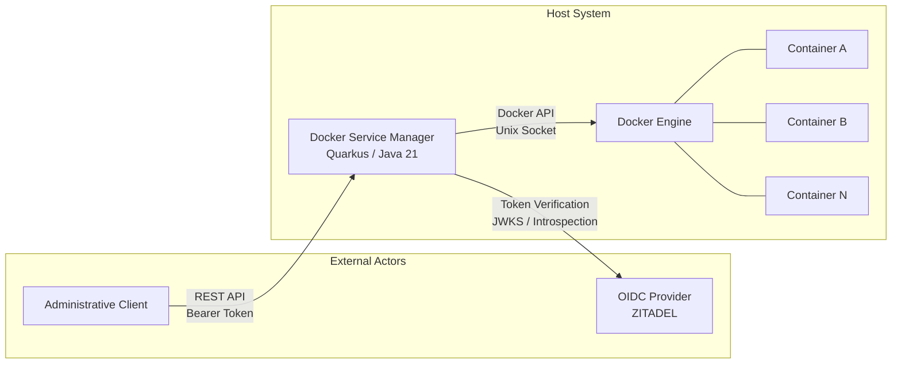
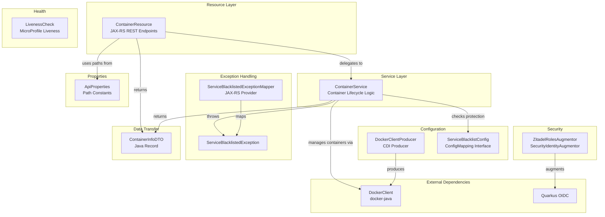
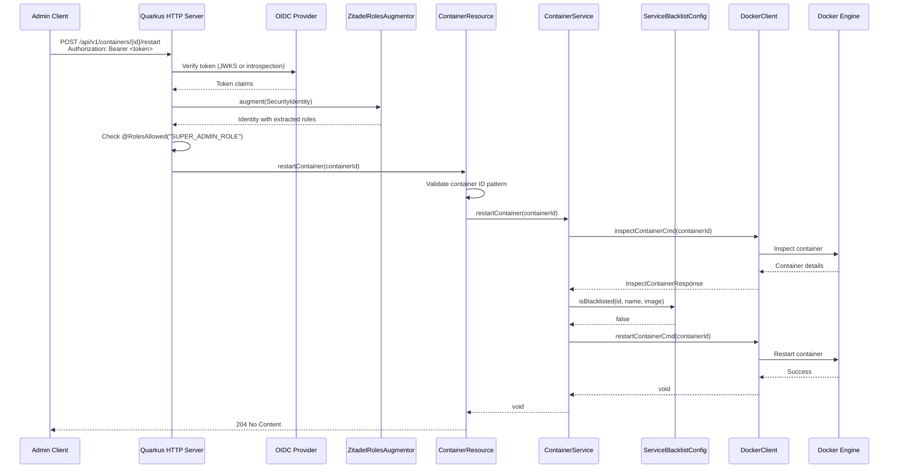
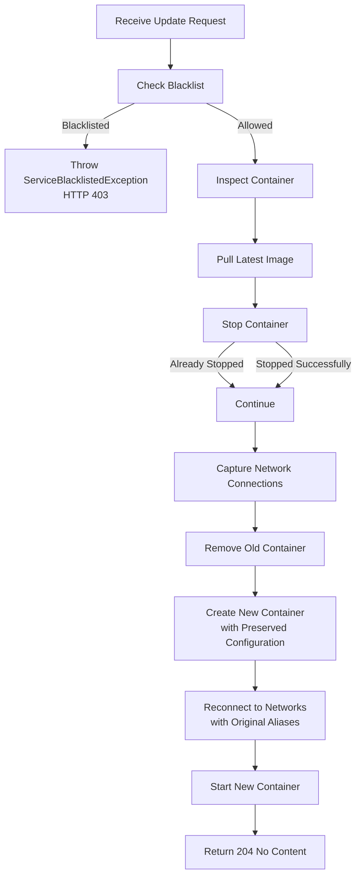
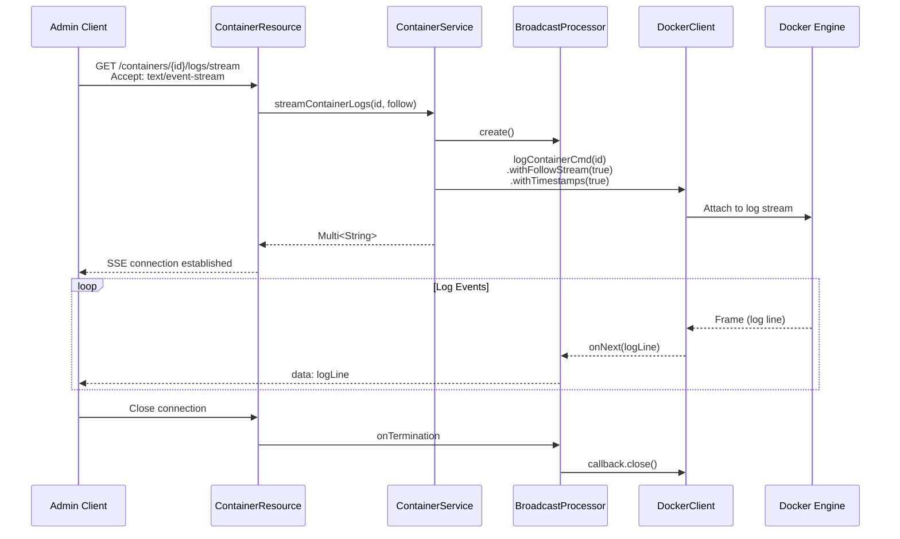
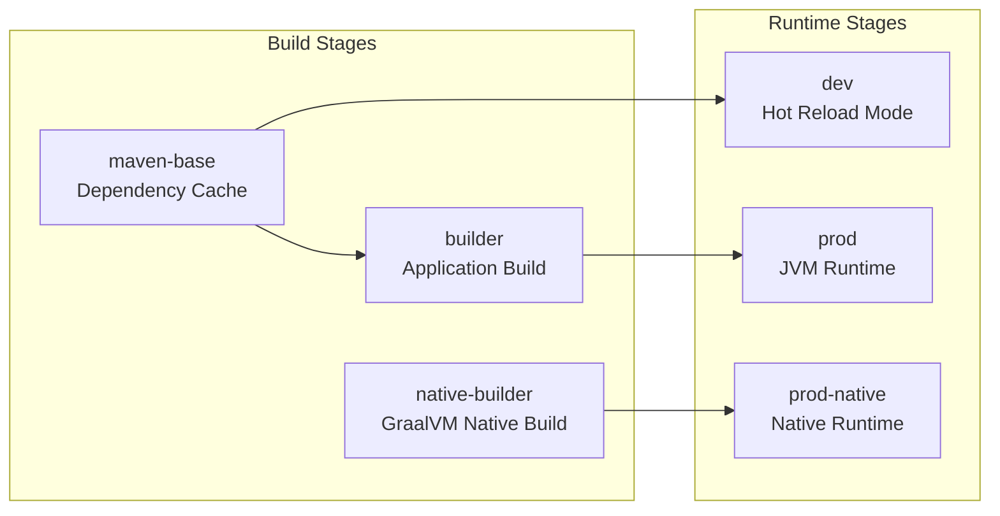
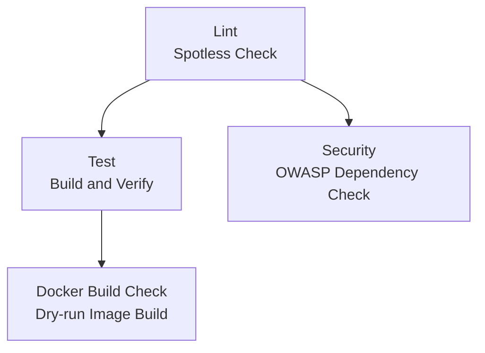

# Docker Service Manager -- Architecture Documentation

## 1. Overview

The Docker Service Manager is a RESTful microservice that provides programmatic lifecycle management for Docker containers. Built on the Quarkus framework with Java 21, the service exposes a secure HTTP API through which authenticated administrators can list, start, stop, restart, and update Docker containers, as well as retrieve and stream container logs in real time. The application communicates with the Docker daemon via the Docker Java client library and delegates authentication to an external OpenID Connect provider.

Within the broader High Entropy API system, the Docker Service Manager serves as an operational control plane. It enables remote administration of containerized services deployed alongside the entropy collection and analysis infrastructure, providing a unified interface for container lifecycle operations without requiring direct host access.

## 2. System Context

The Docker Service Manager operates as an intermediary between authenticated administrative clients and the Docker daemon running on the host system. It does not maintain persistent state of its own; all container state is derived from the Docker Engine at query time.



The service authenticates incoming requests by validating bearer tokens against the configured OIDC provider. JWT tokens are verified locally using cached JSON Web Key Sets, while opaque tokens are validated through the introspection endpoint. All container management endpoints require the `SUPER_ADMIN_ROLE` role, which is extracted from ZITADEL-specific claims by a custom security identity augmentor.

## 3. Internal Architecture

### 3.1 Package Structure

The application follows a layered architecture with clear separation of concerns across seven packages within the `com.ammann.servicemanager` namespace.

```
com.ammann.servicemanager/
    config/             CDI producers and configuration mappings
    dto/                Data transfer objects (Java records)
    exception/          Exception types and JAX-RS exception mappers
    health/             MicroProfile Health check implementations
    properties/         API path constants and configuration properties
    resource/           JAX-RS REST resource endpoints
    security/           OIDC security identity augmentors
    service/            Core business logic and Docker client interactions
```

### 3.2 Component Relationship Diagram



### 3.3 Layer Responsibilities

**Resource Layer.** The `ContainerResource` class defines all JAX-RS endpoints under the `/api/v1/containers` path. It is responsible for HTTP request parsing, input validation via Bean Validation annotations, OpenAPI documentation through MicroProfile annotations, and delegation to the service layer. The resource does not contain business logic.

**Service Layer.** The `ContainerService` class encapsulates all interactions with the Docker daemon through the `DockerClient` interface. It implements container listing, lifecycle operations (start, stop, restart), the container update workflow (pull, stop, remove, recreate, reconnect networks, start), log retrieval, and real-time log streaming via Mutiny reactive streams. Before executing destructive operations, the service consults the `ServiceBlacklistConfig` to determine whether the target container is protected.

**Configuration Layer.** The `DockerClientProducer` is a CDI producer that instantiates and configures a singleton `DockerClient` with connection pooling and timeout settings. The `ServiceBlacklistConfig` is a SmallRye Config mapping interface that reads the comma-separated blacklist from the `service.blacklist` property and provides a default method for matching against container identifiers.

**Security Layer.** The `ZitadelRolesAugmentor` implements the Quarkus `SecurityIdentityAugmentor` interface to extract roles from ZITADEL-specific JWT claims. It processes the `urn:zitadel:iam:org:project:roles` claim structure, with fallback extraction from standard `groups` and `scope` claims. The augmentor supports both JWT tokens and opaque tokens verified via introspection.

**Exception Layer.** The `ServiceBlacklistedException` is a domain-specific runtime exception that carries the container identifier. The corresponding `ServiceBlacklistedExceptionMapper` is a JAX-RS `@Provider` that translates this exception into an HTTP 403 Forbidden response with a structured JSON error body.

**Health Layer.** The `LivenessCheck` implements the MicroProfile Health `@Liveness` contract, providing a static health indicator exposed on the dedicated management port.

**Data Transfer Layer.** The `ContainerInfoDTO` is a Java record that encapsulates the essential container metadata (identifier, name, image, state, and status) returned by list operations.

## 4. Request Processing Flow

The following sequence diagram illustrates the complete request processing path for a container lifecycle operation, including authentication, authorization, blacklist validation, and Docker daemon interaction.



## 5. Container Update Workflow

The container update operation is the most complex workflow in the service. It implements an in-place container replacement strategy that preserves the original container's configuration, including environment variables, labels, exposed ports, command, entrypoint, working directory, user, volumes, health check, host configuration, and network connections.



The update procedure performs the following steps in sequence:

1. **Blacklist validation.** The service inspects the target container and checks its identifier, name, and image against the configured blacklist. Protected containers cannot be updated.
2. **Image pull.** The latest version of the container's image is pulled from the registry. This operation blocks until the pull completes.
3. **Container stop.** The running container is stopped with a 30-second timeout. If the container is already stopped, the `NotModifiedException` is caught and the procedure continues.
4. **Network capture.** The network settings of the original container are recorded, including all connected networks and their aliases.
5. **Container removal.** The old container is forcibly removed.
6. **Container creation.** A new container is created with the updated image, preserving all configuration properties from the original container: environment variables, labels, exposed ports, command, entrypoint, working directory, user, volumes, health check, and host configuration.
7. **Network reconnection.** The new container is connected to each network that the original container was attached to, preserving network aliases. The default bridge network is skipped when custom networks are present.
8. **Container start.** The newly created container is started.

## 6. Service Protection Mechanism

The service blacklist is a security mechanism that prevents critical infrastructure containers from being modified through the API. The `ServiceBlacklistConfig` interface reads a comma-separated list of protected identifiers from the `SERVICE_BLACKLIST` environment variable.

When a destructive operation (stop, restart, or update) is requested, the `ContainerService` inspects the target container and checks three attributes against the blacklist:

| Attribute | Description |
|-----------|-------------|
| Container ID | The full or abbreviated Docker container identifier |
| Container Name | The human-readable name assigned to the container |
| Image Name | The Docker image reference (including tag) |

If any of these attributes matches an entry in the blacklist, the service throws a `ServiceBlacklistedException`, which the JAX-RS exception mapper translates into an HTTP 403 Forbidden response. The `start` operation is intentionally exempt from blacklist enforcement, as starting a stopped protected container is a recovery action rather than a destructive modification.

## 7. Authentication and Authorization

### 7.1 OIDC Integration

The service uses Quarkus OIDC in service application mode, meaning it acts as a resource server that validates incoming bearer tokens but does not initiate authentication flows. The OIDC configuration supports two token types:

- **JWT tokens** are verified locally using the provider's JSON Web Key Set, cached from the JWKS endpoint.
- **Opaque tokens** are validated via the introspection endpoint using `private_key_jwt` client authentication (RFC 7523).

### 7.2 Role Extraction

ZITADEL stores project roles in a non-standard claim structure where role names are object keys rather than array elements:

```json
{
  "urn:zitadel:iam:org:project:roles": {
    "SUPER_ADMIN_ROLE": { "orgId": "123456" }
  }
}
```

The `ZitadelRolesAugmentor` extracts these role names and injects them into the Quarkus `SecurityIdentity`, enabling standard `@RolesAllowed` annotations on resource methods. The augmentor processes claims in the following priority order:

1. ZITADEL project roles claim (`urn:zitadel:iam:org:project:roles`)
2. Standard `groups` claim
3. OAuth2 `scope` claim (space-separated values)

For opaque tokens, the augmentor additionally scans for project-specific claims matching the pattern `urn:zitadel:iam:org:project:{projectId}:roles`.

### 7.3 TLS Configuration

The service supports mutual TLS for production deployments. The TLS configuration uses PKCS#12 keystores and truststores with automatic certificate reload every 15 minutes. In development mode, TLS verification is disabled for the OIDC connection to facilitate local testing.

## 8. Log Streaming Architecture

The service provides two mechanisms for accessing container logs:

**Historical log retrieval.** The `getContainerLogs` method executes a synchronous Docker log command with a configurable tail parameter (1 to 10,000 lines). The callback accumulates log frames into a `StringBuilder` and blocks until completion.

**Real-time log streaming.** The `streamContainerLogs` method uses Mutiny's `BroadcastProcessor` to create a reactive stream of Server-Sent Events. The Docker log command is executed with the follow flag enabled, and each log frame is emitted as an SSE event. Stream termination triggers cleanup of the underlying Docker log callback.



## 9. Docker Client Configuration

The `DockerClientProducer` is a CDI `@Produces` method that creates an application-scoped `DockerClient` instance using the `docker-java` library. The client is configured with the following parameters:

| Parameter | Value | Description |
|-----------|-------|-------------|
| Docker Host | Configurable / auto-detected | Unix socket or TCP endpoint |
| Max Connections | 100 | Connection pool size for the Apache HTTP client |
| Connection Timeout | 30 seconds | Maximum time to establish a connection |
| Response Timeout | 45 seconds | Maximum time to wait for a response |
| Transport | Apache HttpClient 5 | HTTP client implementation |

The Docker host can be overridden via the `docker.host` configuration property. When no override is provided, the client uses the default Docker host detection, which typically resolves to the Unix socket at `/var/run/docker.sock`.

## 10. Build and Deployment Architecture

### 10.1 Build Configuration

The project uses Maven with the Quarkus Maven plugin and the following build-time tools:

| Tool | Purpose |
|------|---------|
| Quarkus Maven Plugin 3.30.6 | Application build, code generation, native image support |
| JaCoCo 0.8.12 | Code coverage with 90% minimum line coverage enforcement |
| Spotless 2.43.0 | Code formatting with Google Java Format (AOSP style) |
| Maven Surefire 3.5.4 | Unit test execution |
| Maven Failsafe 3.5.4 | Integration test execution |

### 10.2 Container Image Stages

The multi-stage Dockerfile provides four build targets:



| Stage | Base Image | Purpose | User |
|-------|-----------|---------|------|
| `dev` | `maven:3.9.9-eclipse-temurin-21` | Development with hot reload and debug port | root |
| `prod` | `ubi9/openjdk-21-runtime:1.23` | Production JVM deployment with G1GC | 185 (non-root) |
| `prod-native` | `ubi9/ubi-minimal:9.5` | Minimal native executable deployment | 1001 (non-root) |

All runtime stages expose ports 9080 (HTTP), 9443 (HTTPS), and 9090 (management). Production stages enforce non-root execution and restrict file permissions to the application user.

### 10.3 CI/CD Pipeline

The GitHub Actions CI pipeline comprises four jobs:



A separate release workflow triggers on version tags and main branch pushes, building multi-architecture images (amd64, arm64) and pushing them to the GitHub Container Registry with semantic version tags and build provenance attestation.

## 11. Network and Port Configuration

The service uses a split-port architecture that separates application traffic from operational endpoints:

| Port | Protocol | Purpose |
|------|----------|---------|
| 9080 | HTTP | REST API endpoints |
| 9443 | HTTPS | REST API endpoints (TLS) |
| 9090 | HTTP | Management interface (health checks, metrics) |
| 5005 | TCP | Remote debug (development mode only) |

Health check endpoints (`/q/health/*`), metrics (`/q/metrics`), and OpenAPI documentation (`/q/openapi`) are explicitly excluded from authentication requirements. All paths under `/api/*` require authenticated access, with CORS preflight (OPTIONS) requests permitted without authentication.

## 12. Technology Stack

| Component | Technology | Version |
|-----------|-----------|---------|
| Runtime Framework | Quarkus | 3.30.6 |
| Language | Java | 21 |
| Build Tool | Apache Maven | 3.9+ |
| Docker Client | docker-java | 3.3.4 |
| HTTP Transport | Apache HttpClient 5 | (via docker-java) |
| Reactive Streams | SmallRye Mutiny | (via Quarkus) |
| Authentication | Quarkus OIDC | (via Quarkus) |
| API Documentation | SmallRye OpenAPI | (via Quarkus) |
| Health Checks | SmallRye Health | (via Quarkus) |
| Input Validation | Hibernate Validator | (via Quarkus) |
| Serialization | Jackson | (via Quarkus REST) |
| Test Framework | JUnit 5 + Mockito | (via Quarkus) |
| Assertion Library | AssertJ | 3.26.3 |
| License | MIT | -- |